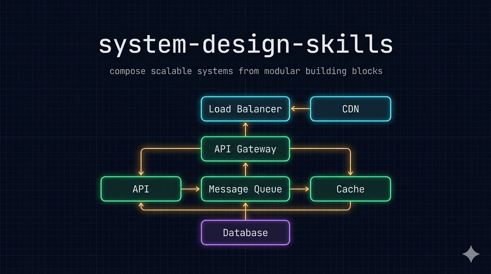
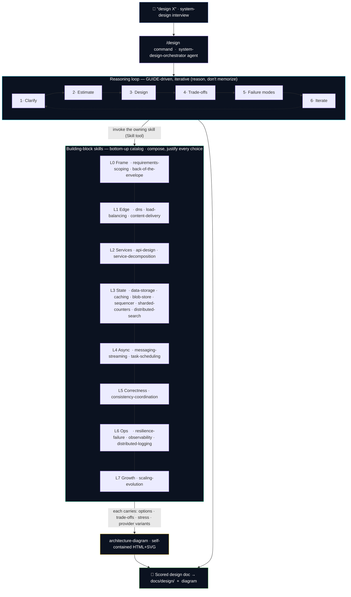
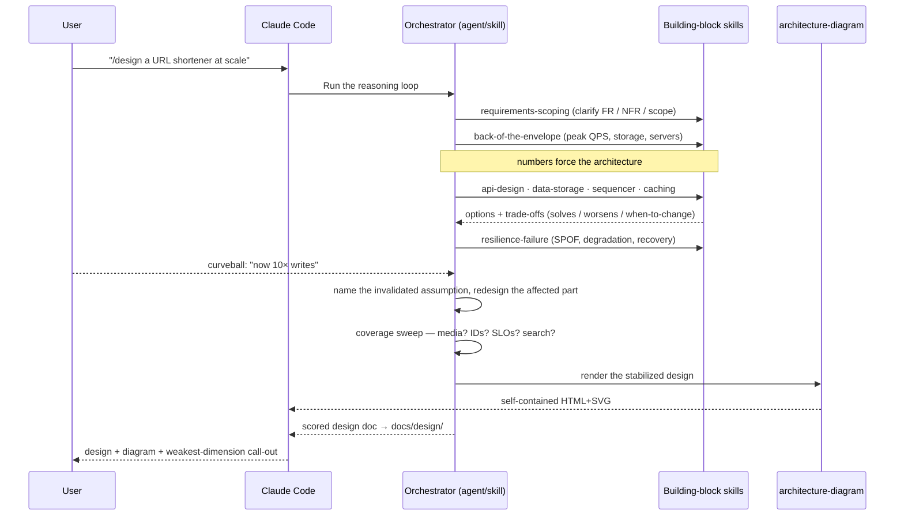

# system-design-skills

<p align="center">
  
</p>

[](LICENSE)
[](https://code.claude.com/docs/en/plugins)
[](#building-blocks)
[](#design-principle)
[](#provider-modularity)

**Design scalable systems the way strong engineers actually do — by reasoning, not by memorizing diagrams.** A divide-and-conquer wiki of composable building-block skills for Claude Code: clarify requirements, size with numbers, compose the right components, justify every trade-off, and stress-test for failure — then score and persist the design. Works in Claude Code, and any agent that can run skills.

---

## At a glance



Most system-design material teaches you to memorize finished architectures. That is exactly the trap that makes strong engineers fail design discussions: the moment a constraint changes, a memorized diagram falls apart and there is no reasoning underneath to rebuild it. This plugin ships **building blocks** — one skill per part of a system, each a reusable recipe with explicit trade-offs, behavior under stress, the numbers that matter, and cloud-provider variants — that you **compose** to fit the problem in front of you.

---

## Quick Start

### Installation

#### Option 1: CLI Install (Recommended)

Use [npx skills](https://github.com/vercel-labs/skills) to install the skills directly:

```bash
npx skills add proyecto26/system-design-skills
```

This installs into your `.claude/skills/` directory.

#### Option 2: Claude Code Plugin

```bash
# Add the marketplace
/plugin marketplace add proyecto26/system-design-skills

# Install the plugin (skills + the /design command + the orchestrator agent)
/plugin install system-design-skills
```

> **SSH errors?** The marketplace clones via SSH. If you don't have SSH keys on GitHub, force HTTPS:
> ```bash
> /plugin marketplace add https://github.com/proyecto26/system-design-skills.git
> /plugin install system-design-skills
> ```

#### Option 3: Clone and Copy

```bash
git clone https://github.com/proyecto26/system-design-skills.git
cp -r system-design-skills/skills/* .claude/skills/
```

#### Option 4: Local / development

```bash
git clone https://github.com/proyecto26/system-design-skills.git
claude --plugin-dir ./system-design-skills
```

#### Option 5: Fork and Customize

Fork the repo, add your own building blocks or provider files (follow `meta/SKILL-CONTRACT.md`), and point your projects at your fork.

### Your first design

No configuration, API keys, or runtime dependencies — just describe what you want:

> *"/design a URL shortener that handles billions of reads and 10k writes/sec"*

Claude runs the full loop — clarifies scope, sizes it with back-of-the-envelope numbers, composes the building blocks, weighs trade-offs, stress-tests failure modes, scores the design, and writes it to `docs/design/`.

---

## The three ways to use it

1. **Run the workflow.** `/design <system>` runs the whole process (or dispatches to the **`system-design-orchestrator`** agent). Best for full designs and interview practice — it scores the result against the GUIDE quality bar and persists the design doc.
2. **Start a design conversationally.** Trigger the **system-design** orchestrator skill ("design WhatsApp-scale messaging"); it runs the same loop and routes to the blocks.
> **Preparing for an interview?** [`docs/study-path.md`](docs/study-path.md) sequences the plugin into a learn → drill → self-test path (method, numbers, building-block syllabus, mistakes checklist, and the practice bank).

3. **Reason about one part.** Trigger a building block directly ("what caching strategy here?", "SQL or NoSQL for this?", "how do I shard this table?") — the recipe, trade-offs, and provider variants for just that part.

---

## Building blocks

22 skills: an orchestrator, a diagram engine, and 20 building blocks arranged **bottom-up** so each layer depends only on the ones beneath it.

| Layer | Blocks | What they decide |
|:------|:-------|:-----------------|
| **L0 Frame** | `requirements-scoping` · `back-of-the-envelope` | what to build, how big |
| **L1 Edge** | `dns` · `load-balancing` · `content-delivery` | get traffic in, served close |
| **L2 Services** | `api-design` · `service-decomposition` | the interface boundary + how the system is split into services |
| **L3 State** | `data-storage` · `caching` · `blob-store` · `sequencer` · `sharded-counters` · `distributed-search` | store it, read it fast |
| **L4 Async** | `messaging-streaming` · `task-scheduling` | decouple, schedule, absorb spikes |
| **L5 Correctness** | `consistency-coordination` | CAP, ordering, consensus |
| **L6 Ops** | `resilience-failure` · `observability` · `distributed-logging` | degrade, see, survive |
| **L7 Growth** | `scaling-evolution` | what changes at 10×/100× |
| **Render** | `architecture-diagram` | draw any of the above |

Every block follows one contract (`meta/SKILL-CONTRACT.md`): *When to reach for it · Clarify first · Options · Trade-offs (solves / worsens / when-to-change) · Behavior under stress · How to apply · Dos & Don'ts · Numbers that matter · Choosing a provider · Related blocks.*

---

## Usage examples

Just describe what you need — the right skill triggers automatically:

**"/design a rate limiter for our API across 100 gateway nodes"**
> Runs the full loop and composes `resilience-failure` (algorithm) + `sharded-counters` (hot-key counts) + `api-design` (429/Retry-After contract).

**"SQL or NoSQL for a chat app, and how would I shard it?"**
> `data-storage` — the SQL/NoSQL trade-off table, key design, and sharding strategy with their failure modes.

**"What caching strategy for a read-heavy feed? I'm worried about stampedes."**
> `caching` — read/write strategies, eviction, and the thundering-herd / hot-key mitigations.

**"How many servers and how much storage for 100M DAU posting twice a day?"**
> `back-of-the-envelope` — QPS, storage, bandwidth, server count (run `scripts/botec.py` for an exact check).

**"We lost a region — what breaks and how do we degrade?"**
> `resilience-failure` + `consistency-coordination` — SPOFs, failover, and the degradation story (stale beats error).

**"Draw the architecture for what we just designed."**
> `architecture-diagram` — a self-contained dark-theme HTML+SVG diagram (with PNG/PDF export).

---

## Provider modularity

Every building block defaults to a **generic, vendor-neutral recipe**. When a cloud is named, the skill reads `references/providers/<provider>.md` for the concrete managed-service mapping, quotas/limits, and provider-specific trade-offs (AWS · Azure · GCP, plus Temporal for durable execution). If no provider file exists for a request, the generic recipe is the answer — by design, never an invented service.

---

## How it works



The diagram engine is **self-contained**: one HTML file with inline SVG, a system monospace font (no web-font fetch), no Mermaid. The only external calls are two pinned, SRI-protected CDN scripts that power the **optional** PNG/PDF export — omit them and the diagram still renders.

---

## Running the evals

A realistic eval harness measures whether the skills make Claude design *better* (not just differently). Everything lives in `meta/evals/`.

- **Eval set** — `meta/evals/evals.json`: multi-turn exercises (URL shortener, rate limiter, news feed, observability pipeline, typeahead, WhatsApp) that each lead with different blocks. Scored on 6 GUIDE behaviors (clarify / quantify / trade-offs / failure / pivot / concrete-API) + a composition check.
- **Trigger evals** — `meta/evals/trigger-evals.json`: ~20 should / should-not routing queries.
- **Run a comparison** (with-skill vs baseline, then a judge) — the method is in `meta/evals/README.md`; run it with whatever orchestration you have. The first run (`meta/evals/iteration-1/`) scored **with-skill 30/30 vs baseline 20/30** with composition confirmed real.
- **Deterministic check** (the one objectively-scriptable surface):
  ```bash
  python3 skills/back-of-the-envelope/scripts/test_botec.py   # asserts calculator == golden fixture
  ```

See `meta/evals/README.md` for the full methodology (multi-turn delivery, broad coverage, variance, regression baselines).

---

## Project structure

```
system-design-skills/
├── .claude-plugin/
│   ├── plugin.json                  # plugin manifest
│   └── marketplace.json             # marketplace metadata
├── agents/
│   └── system-design-orchestrator.md  # autonomous driver of the reasoning loop
├── commands/
│   └── design.md                    # /design <system> — runs the workflow
├── skills/
│   ├── system-design/               # ORCHESTRATOR — reasoning loop + routing + templates
│   ├── <20 building blocks>/        # SKILL.md + references/ (+ providers/ for component blocks)
│   └── architecture-diagram/        # DIAGRAM ENGINE — self-contained HTML+SVG
├── docs/                            # shared, in-repo references (not skills)
│   ├── GUIDE.md                     #   the ten failure modes (source of the method)
│   ├── study-path.md                #   interview-prep study path (links the pieces)
│   └── hero.png                     #   README banner
├── meta/                            # maintainer docs + eval set (not skills)
│   ├── SKILL-CONTRACT.md            #   the authoring contract every block follows
│   ├── PLAN.md                      #   creation plan + status
│   └── evals/                       #   realistic eval set + results (evals.json, iteration-1/)
├── LICENSE
└── README.md
```

> For the method, read the `system-design` skill's `references/` (reasoning loop, failure modes, trade-off framework, building-blocks index). For the shared shape of every block, read `meta/SKILL-CONTRACT.md`.

---

## Known limitations

- **Reasoning is subjective, not deterministic.** These are judgment skills; only `back-of-the-envelope` ships a scriptable calculator + golden fixture. The eval grades behaviors, not a single "right" answer.
- **Provider numbers drift.** Managed-service quotas/limits change — provider files mark them "verify against current docs" and intentionally avoid being exhaustive service catalogs.
- **Diagram export needs two CDN scripts.** The diagram *renders* fully offline; the PNG/PDF export buttons load two pinned, SRI-protected scripts.
- **No live state.** The plugin has no runtime, server, or API keys — it's pure skills + one stdlib Python calculator.

---

## Design principle

> Do not memorize architectures; learn the forces that shape them.

There is no single correct design — success depends on the assumptions you make explicit. Treat every architecture as a hypothesis that holds until a constraint changes, and be ready to redraw it calmly when one does.

---

## 👍 Credits

Built on the shoulders of the best system-design resources:

- [The System Design Primer](https://github.com/donnemartin/system-design-primer) — building blocks, CAP, and worked examples
- [*System Design Interview*](https://bytebytego.com/) (Alex Xu / ByteByteGo) — the four-step process and back-of-the-envelope numbers
- *Grokking Modern System Design* — the bottom-up building-block catalog
- [*Designing Data-Intensive Applications*](https://dataintensive.net/) (Martin Kleppmann) — data-systems fundamentals
- [`docs/GUIDE.md`](docs/GUIDE.md) — the ten system-design failure modes that shape the reasoning loop (condensed, runtime version embedded in `skills/system-design/references/failure-modes.md`)

---

## 🌟 Star History

[](https://star-history.com/#proyecto26/system-design-skills&Date)

## 💜 Sponsors

This project is free and open source. Sponsors help keep it maintained and growing.

[**Become a Sponsor**](https://github.com/sponsors/proyecto26) | [Sponsorship Program](https://proyecto26.com/sponsors/)

## 🤝 Contribution

When contributing to this repository, please first discuss the change you wish to make via issue, email, or any other method with the owners of this repository before making a change. Any contributions you make are **greatly appreciated** ❤️.

See the [contribution guide](https://github.com/proyecto26/.github/blob/master/CONTRIBUTING.md).

## ⚖️ License

This repository is available under the [MIT License](./LICENSE).

## Happy vibe coding 💯

Made with ❤️ by [Proyecto 26](https://proyecto26.com) — Changing the world with small contributions.

One hand can accomplish great things, but many can take you into space and beyond! 🌌

Together we do more, together we are more ❤️ 
