System Design exercises contain a counterintuitive trap: the more you rely on memorized architectures and patterns, the more likely you are to fail.

Strong engineers often get rejected not because their design was wrong, but because they optimized for the wrong signals. Developers who propose "ideal" solutions from tutorials often leave confused when those solutions don't land. They fail to explain the reasoning behind the architecture.

Developers rarely fail because they cannot design systems. They fail because they misunderstand the evaluation criteria. Unlike coding exercises, System Design failure modes are subtle and often invisible until the final decision. 
So instead of having templates for full architectures/solutions, this plugin focuses on divide and conquer strategies, and how to break down a problem into smaller, more manageable pieces/parts of the system, so we can have like formulas and templates for specific parts of the system, and then we can combine those parts together to create a full architecture/solution.

I’ll break down the most common reasons engineers fail System Design exercises:

1. Inadequate understanding of distributed system fundamentals

This is the most common and difficult failure mode. While the core problem is simple, it carries hidden risks that the exercise will expose.

This gap appears during minor design changes. For example, if you choose leader-follower replication, a developer might ask how the system handles consistency during a network partition.

Leader–follower replication under a network partition highlights consistency and availability trade-offs:
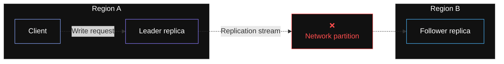

There are two primary outcomes:
- Consistency first: Reject writes when quorum is unavailable or fail fast with an error.
- Availability first: Accept writes locally and reconcile later using conflict resolution or single-writer guarantees.
Developers relying on memorization struggle here. Strong developers immediately identify the trade-off: explaining whether the system rejects writes to preserve invariants or allows divergence for availability.

Exercises weigh this heavily. Distributed systems fundamentals require deliberate study. Without them, engineers cannot reason about trade-offs, making every decision a guess.

> Tip: When you study any System Design case study, always ask what changes if latency increases, if a region is lost, or if consistency guarantees become stricter.

Engineers will assume you know common case studies. They challenge reasonable solutions to test if you understand why the design works, not just that it works.

```
Key takeaway: Invest time in the fundamentals of distributed systems. Build intuition around the following points:
Consistency, availability, and partition tolerance (CAP)
Replication, quorum choices, and sharding strategies with their failure modes
Strong vs. eventual consistency
SQL vs. NoSQL trade-offs
```

Do not memorize architectures; learn the forces that shape them.

2. Treating building blocks as opaque primitives

Using components without understanding their internal mechanics is a major error. You must understand how primitives like databases, caches, and queues behave under real-world pressure.

Casually mentioning a component to "solve" a bottleneck is insufficient. The design collapses when asked why a specific tool was chosen or how it handles traffic spikes.

> Tip: When adding a new component, don’t just list its benefits; also consider its drawbacks. Explicitly ask yourself: What new risks does this introduce? How will I monitor it when it is under stress?

This gap becomes visible during stress scenarios. For example, if traffic spikes and cache hit rates drop, which component do you investigate first?

Stress events can propagate from cache to database to queue, amplifying load if not managed correctly:
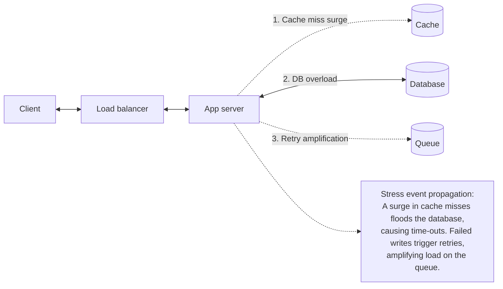

Strong developers reason through pressure points. They explain how cache eviction storms, aggressive retries, or misconfigured health checks can amplify load.

> Note: If your only justification for a component is that it is “industry standard,” you are borrowing someone else’s context instead of applying your own reasoning.

Move beyond abstractions and demonstrate understanding of specific trade-offs:
- Load balancers: Explain Layer 4 vs. Layer 7 balancing and how health checks can accidentally DDoS a recovering service.
- Caching: Match eviction policies to access patterns and explain when write-through is safer than write-back.
- Message queues: Describe delivery guarantees (at-least-once vs. exactly-once) and duplicate handling.

```
Key takeaway: Master the core building blocks and how they behave under failure.
- Databases: Indexing strategies, replication lag, and connection pooling.
- Caches: Eviction policies, cache penetration, and the thundering herd problem.
- Load balancing: Traffic shaping algorithms and sticky sessions.
- Queues: Backpressure, dead-letter queues, and async processing.
```
Learn how each component behaves under stress, not just how to name it.

3. Rushing to design without clarifying requirements

Developers often abandon the discipline of clarifying requirements in System Design exercises. Rushing to a solution suggests rote memorization.

Instead of identifying the problem, these developers attempt to apply a familiar solution to the prompt.

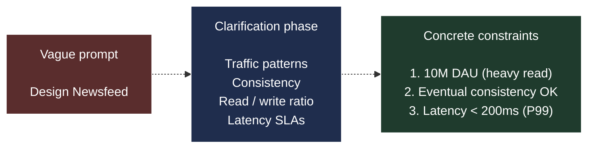
> Vague prompts must be refined into concrete constraints before design begins

Developers test this by introducing curveballs. If load doubles, many devs freeze or suggest generic fixes like "add more servers" without diagnosing the bottleneck.

They might suggest sharding the database when the bottleneck is actually in the compute layer.

> Note: I am not currently seeking a solution. I am looking for the kind of diagnostic conversation you would have with a teammate during a production incident.

Strong developers ask diagnostic questions: Did user count increase? Are database latencies rising? Is the cache hit rate dropping?

Responding quickly often signals impatience. Real engineering requires narrowing down the problem before concluding.

```
Key takeaway: Never design without explicitly defining three categories of requirements:
- Functional requirements: What the system does (e.g., posting content, viewing feeds).
- Non-functional constraints: The numbers that shape the design (DAU, QPS, P99 latency targets).
- Out of scope: What is intentionally excluded to keep the design focused.
```

4. Weak trade-off articulation

Solid engineers often fail to justify choices. "Design by name-dropping" involves listing technologies (e.g., Kafka, DynamoDB) without context or alternatives.
Listing tools without explaining their trade-offs signals that you are repeating patterns instead of designing a system.

> Note: Listing tools without explaining their trade-offs is a signal that you are repeating patterns instead of designing a system.

Every decision represents a trade-off. You must balance latency against throughput or consistency against availability. Merely stating a tool "scales" is not a justification.

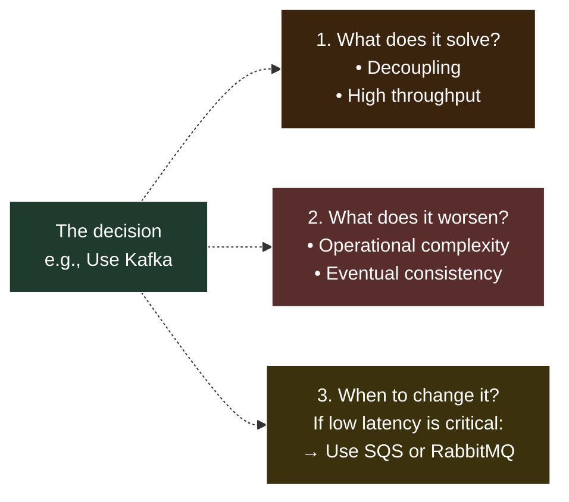

> Every major design choice must be analyzed: what it solves, what it worsens, and when to abandon it

Follow-up questions seek clarification, not trivia. Developers test reasoning under constraints, asking why you chose specific tools or consistency models.

> Tip: After every major design choice, write down one thing it improves and one thing it makes harder. If you cannot do that, you do not yet own the decision.

Strong engineers analyze tools rather than just naming them. They connect workload characteristics to system behavior and acknowledge downsides, such as increased operational complexity.

Engineers who cannot articulate trade-offs are guessing. If you do not understand the cost of a tool, you cannot effectively architect a system.

```
Key takeaway: For every major component you introduce, practice answering the following three questions:
- What problem does this solve?
- What does it make worse?
- What would make you change this decision?
```

If you cannot answer all three, the decision is not grounded yet.

5. No sense of scale or numbers

Designing without numbers leads to arbitrary choices. Terms like "high traffic" are meaningless without quantification.

A design for 1k QPS differs fundamentally from one for 1M QPS. Similarly, 10 GB of data fits in memory, while 10 TB requires distributed storage.

> Tip: Whenever you hear yourself say “high scale” or “heavy traffic,” stop. Convert that phrase into a few concrete numbers before proceeding.

Estimates dictate design. A 95% read ratio suggests caching, while 10x write spikes require ingestion queues.

Start with back-of-the-envelope estimates. For example, 100M DAU with 50 reads each equals 5B daily reads. This implies ~300k QPS at peak. We’ll cover the details behind these estimates later in the course during the back-of-the-envelope calculation section.

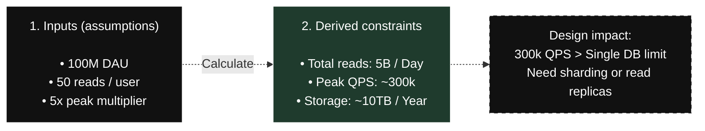

> Back-of-the-envelope estimates turn vague load into concrete design constraints

Calculations signal necessary architectural shifts, such as moving to read replicas or sharding. Precision is less important than directional correctness.

Operating without numbers is guessing. Numbers ground engineering decisions and prove your architecture can handle the load.

```
Key takeaway: Practice quick, rough estimates before committing to an architecture. For example:
- QPS: Estimate the average and peak load to size load balancers and compute resources accordingly.
- Data growth: Calculate storage needs on both a daily and yearly basis to effectively plan sharding, compaction, and archival strategies.
```

6. Ignoring failure modes and degradation

Real-world components fail. Designs assuming infinite uptime are incomplete. You must account for node crashes, network partitions, and dependency failures.
Dependencies slow down and caches evict hot keys. If you do not account for these scenarios, the design is fragile.
What happens if a core service fails? Weak developers suggest indefinite retries, which exacerbates outages.

> Note: If your only response to a failure is “more retries,” you are very likely amplifying the outage instead of containing it.

Strong engineers use patterns like circuit breakers to ensure graceful degradation. For example, falling back to a cached list if the recommendation engine fails.

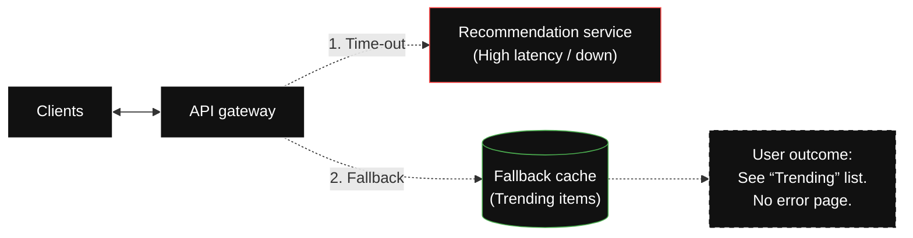

> When the recommendation service fails, the system falls back to a cache

Availability often trumps correctness. It is better to serve stale data than return an error. Real systems are defined by their behavior during failure.

Designing for failure is mandatory. Assume every component will break and plan the user experience for that moment.

```mermaid
Key takeaway: Run a resilience checklist on your design, such as:
- Single points of failure (SPOF): If this box disappears, does the whole system stop?
- Degradation strategy: If this dependency is slow, do we fall back to cache, show partial results, or hide the feature?
- Recovery: When the service comes back online, how do we prevent it from being overwhelmed by pending requests?
```

7. Over-indexing on the “Correct” architecture instead of reasoning

Many developers hunt for the "right answer" based on canonical architectures. This leads to optimizing for an expected diagram rather than sound reasoning.

Engineers evaluate the journey, not just the destination. Developers often skip intermediate steps, treating technologies like Kafka or sharding as defaults regardless of the prompt.

Developers who struggle here tend to rush to the final architecture, skipping intermediate steps. They treat complex decisions as defaults, assuming specific technologies, such as Kafka or sharding, are always the answer, regardless of the prompt.

> Note: If a small change in constraints makes your entire design fall apart, it is a sign that you memorized a diagram instead of reasoning from the problem.

Memorized designs unravel when constraints change. Strong engineers adapt, treating the architecture as a hypothesis rather than a destination.

They treat the architecture as a hypothesis rather than a destination. Each component exists to satisfy a current constraint, not to match a known tutorial diagram.

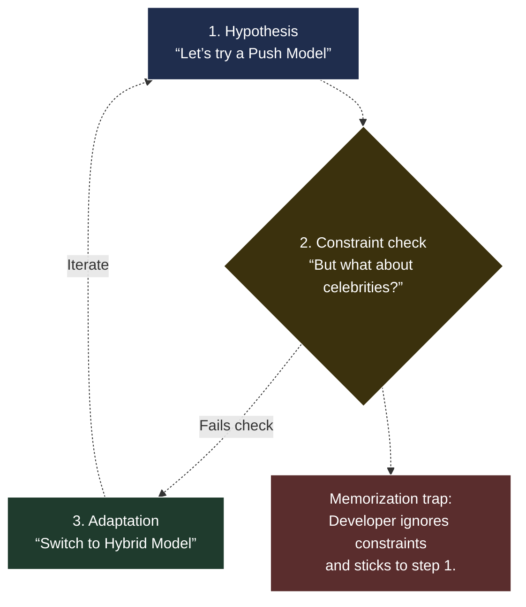

Strong engineers move through a reasoning loop instead of locking onto a single diagram

Adaptability is a primary signal. Engineers who reason from constraints can redesign calmly when assumptions change.

Narrating your thinking invites the engineer to collaborate. This turns the exercise into a working session.

```
Key takeaway: Stop optimizing for the final diagram. Narrate your thinking loop instead.
- State the problem: What specific constraint are we solving right now?
- Justify the design: Why does this choice work under the current assumptions?
- Define the breaking point: What change in constraints would necessitate a redesign of this part?
```

Reasoning beats correctness every time.

8. Weak API and data-model thinking#

Vague APIs and data models are a common failure mode. Developers often focus on infrastructure boxes while ignoring the details that make the system work.

Constraints become real at the interface level. A "NoSQL" box solves nothing if you cannot define the primary key and access patterns.

> Note: If you cannot write down a concrete request, response, and primary key, the rest of your diagram is just guesswork.

Weak designs fail under concrete questions about API responses or pagination strategies. Strong engineers define specific request shapes and access paths.

Weak developers answer in abstractions, stating they will “fetch the feed” or “store posts.” Strong engineers answer with structure. They define specific request shapes, explicit keys, and explain how data is accessed rather than just where it lives.

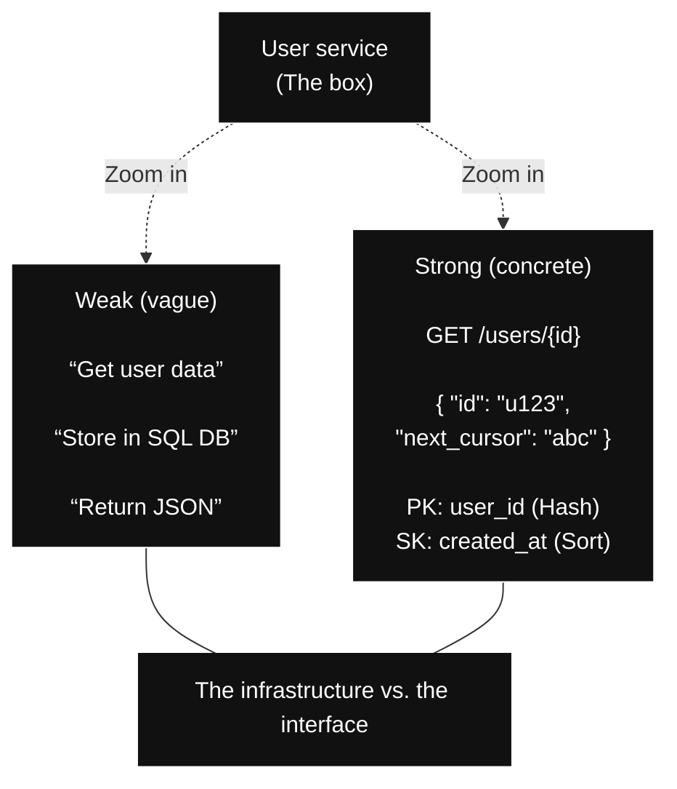

> Concrete APIs and schemas turn vague boxes into real contracts

Design decisions converge at the interface. Poor schema design creates scaling ceilings. If you cannot describe data flow, the design is just empty boxes.

Explicit APIs and schemas make performance limits and trade-offs visible.

```
Key takeaway: Practice defining concrete interfaces and schemas.
- Request and response shapes: Write clear JSON structures for your core APIs.
- Schema definition: Define primary and sort keys with specific access patterns in mind.
- Mechanics: Be explicit about pagination strategies, versioning, and idempotency keys.
```

9. Treating the exercise as a presentation instead of a collaboration

System Design exercises are collaborative dialogues, not lectures. Developers who monologue or resist interruption misunderstand the evaluation.

Engineers evaluate whether they could work with you on a messy problem. Real design work is iterative and conversational.

Strong engineers invite feedback and adjust in real time. They treat hints as collaboration, not correction.

> Note: If you treat every question as an attack on your design, you miss the chance to use the engineer as a partner in the conversation.

Weak developers defend their initial design rigidly. This rigidity is more concerning than a flawed idea.

Exercise interaction patterns:
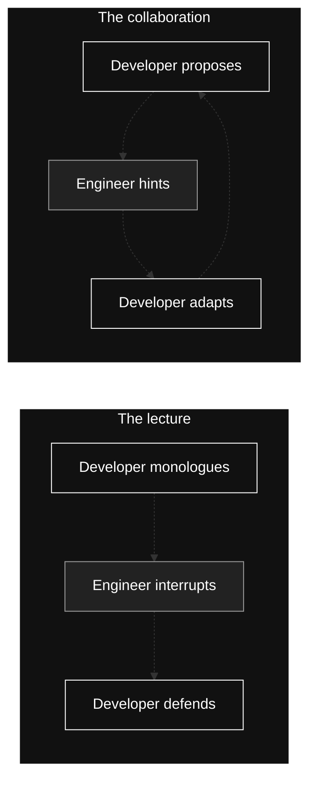

When interrupted, strong developers pause, ask clarifying questions, and adjust reasoning. The conversation should feel like a design review.

Engineers seek perspective on collaborative problem solving. Treating the exercise as a presentation causes mistakes to compound.

```
Key takeaway: Treat the engineer like a teammate.
- Pause when you are challenged.
- Ask clarifying questions.
- Think out loud and adapt.
```

Design reviews are collaborative. Your exercise should be, too.

10. Inability to course-correct when constraints change

Inability to pivot often results in rejection. Engineers intentionally change constraints (e.g., scale, latency) to test if you can let go of your original idea.

Developers often fall into a sunk cost mindset, defending outdated assumptions. Strong engineers reset calmly, understanding that design is a function of constraints.

> Note: A change in constraints is not a trick. It is an invitation to show that your design is driven by reasoning instead of attachment to the first diagram you drew.

Explicitly state when new constraints invalidate earlier assumptions. Propose a redesign, such as switching from http long-polling to a push-based model.

Constraint changes expose whether you defend assumptions or revisit them:
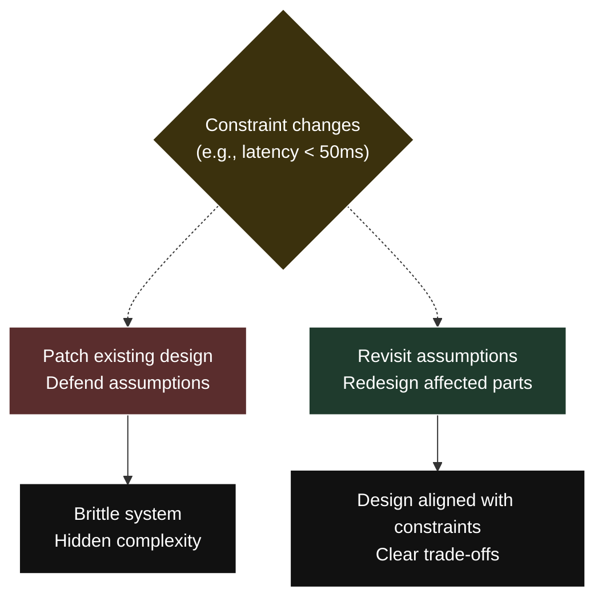

Constraint changes test active reasoning versus rigid memorization. Pivoting shows you optimize for correctness.

Flexibility signals experience. Senior engineers discard solutions when the problem changes; junior engineers force them to work.

```
Key takeaway: Practice redesigning systems mid-stream.
- Audit assumptions: Ask yourself what the most fragile assumption is in this design.
- Force a redesign: Mid-stream, ask, “What if read traffic doubled?” or “What if we lost this data center?”
- Let go of your initial design: Be willing to erase a component you’ve just drawn if a better option emerges.
```

## What success actually looks like in a System Design exercise

Success feels distinctly different from failure. Strong engineers do not rush, hunt for a perfect diagram, or try to impress with buzzwords. Instead, they consistently demonstrate a structured, iterative process.

> Note: In a strong exercise, the conversation feels like two engineers working through a problem, not one person defending a slide.

This process is a loop. Strong engineers move through specific phases of reasoning to build a grounded solution.

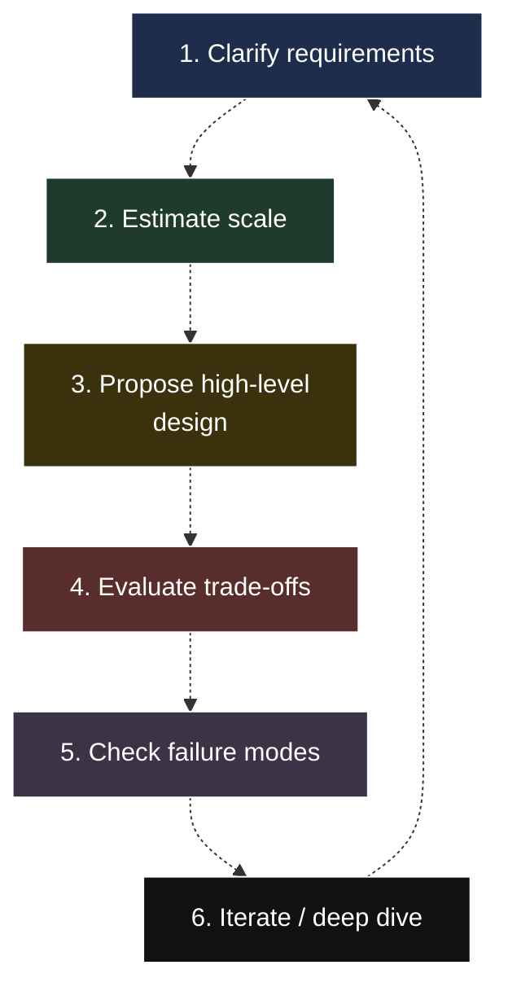

> Success comes from iterating through clarification, estimation, and trade-offs

This loop manifests in six specific behaviors:
- Start with the problem: Clarify requirements, traffic patterns, and failure tolerance goals before drawing.
- Think in trade-offs: Reason through choices and surface downsides (e.g., why async processing suits a workflow better than synchronous calls).
- Use building blocks intentionally: Justify components. Explain eviction policies for caches or delivery guarantees for queues.
- Anchor designs with numbers: Use rough estimates for QPS and data size to guide decisions.
- Design for failure: Plan for partial outages, degraded modes, and timeouts.
- Collaborate: Think out loud, treat hints as signals, and adjust when challenged.

When a engineer succeeds, the exercise feels like a collaborative working session between colleagues.


## System Design exercise self-assessment checklist

Use this checklist to spot gaps in your preparation.

> Note: This checklist is a reflection tool. It helps you see patterns over time rather than grade a single exercise.

Consistently checking these boxes indicates you are operating at a senior level.
- Fundamentals: Can I explain consistency models, replication, sharding, and trade-offs without relying on buzzwords?
- Building blocks: Do I understand how the components I choose behave under load and failure, not just what they are called?
- Requirements: Did I clarify functional scope, non-functional constraints, and what is out of scope before designing?
- Trade-offs: For every major decision, can I explain what it solves, what it makes worse, and when I would change it?
- Scale and numbers: Did I anchor the design with rough estimates for traffic, data size, and growth?
- Failure and resilience: Did I discuss what breaks, how the system degrades, and what the user experiences during failure?
- Collaboration: Did I treat the exercise like a design review and adapt my thinking based on feedback?

System Design exercises reward depth, curiosity, and judgment. Engineers fail when they optimize for speed and memorization rather than reasoning.

Slow down. Ask better questions. Make reasoning explicit. Embrace trade-offs. Design for failure. Stay adaptable. This is how strong system designers operate.